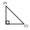

# Watchful
Line segments that follow the cursor

This project really got me thinking. I tried many different ways of forming line segments in an attempt to make them point at a mouse.

I ended up taking a mathematical approach.

Consider this diagram:

In this diagram, `(P)` is a fixed point
and `(C)` is the position of a user's cursor on a canvas.
